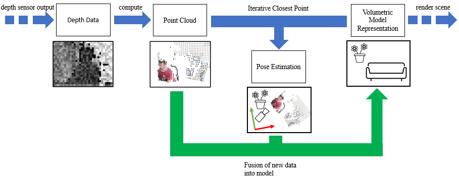

### Fusion Reimplementation

## Overview

This program implements a full Kinect Fusion algorithm, realized in OpenGL with ComputeShaders.
It is based on the [original paper](https://www.microsoft.com/en-us/research/wp-content/uploads/2016/02/ismar2011.pdf) and the [follow up](https://www.microsoft.com/en-us/research/wp-content/uploads/2016/02/kinectfusion-uist-comp.pdf) by Microsoft Research.

The algorithm works by processing a stream of depth images and building a coherent model of the full scene by merging all data into a single representation structure continuously in real time, while also providing a highly accurate pose estimation of the camera.

As part of my thesis I implemented all of the core Kinect feature set in OpenGL compute, as well as having most parts implemented as a CPU reference, apart from the SDF integration and reference for ICP, due to performance limitations since the systems only work with a high enough framerate and the naive single-threaded CPU implementation can not keep up.

The program can be controlled with mouse input, using a comprehensive GUI.

## Locations

The compute shader code can be found in [/resources/shaders](/resources/shaders/).

The .cpp source code is located in [/src](/src/)

## Getting Started 

### External Dependencies

The input used is a first-generation Kinect camera, but the algorithm can easily be adapted for any RGB-D input (with known camera parameters).

The application is built upon [OpenFrameworks](https://openframeworks.cc/download/), which is a very thin, easy to use open source platform that is compatible with numerous operating systems and used for general visualization.

For access to data from the Kinect sensor, OpenFrameworks by default supplies a wrapper for [libfreenect](https://github.com/OpenKinect/libfreenect).
The user's system must be setup with the correct open drivers, a guide can be found here: https://openkinect.org/wiki/Getting_Started

The [Eigen]() library is used for decomposition of linear systems and comes pre-installed in [/deps/Eigen](/deps/Eigen/)

For the GUI a simple [Dear Imgui](https://github.com/ocornut/imgui) wrapper is used, which comes as an [openFrameworks addon](https://github.com/jvcleave/ofxImGui).

### Compilation

For compilation OpenFrameworks has to be installed and the OpenFrameworks Project Generator can then parse the folder and setup the locally used IDE for compilation.

The usual setup is to add the project to 
> openframeworks/apps/myApps/

For this path configuration there are provided solution files for Windows (Visual Studio 2019) or Linux (QTCreator).
